# AruaTech — USV-AM · Drone Fluvial Autônomo

> **USV-AM** (Veículo Fluvial Não Tripulado — Amazônia) é uma plataforma open source de navegação autônoma e monitoramento para rios amazônicos. Integra **firmware embarcado (ESP32)**, um **elo de nuvem (Raspberry Pi 4)**, **backend Firebase (RTDB)** e um **dashboard web (React + Cesium)**.


---

## Índice

- [1. Visão geral](#1-visão-geral)
- [2. Arquitetura](#2-arquitetura)
- [3. Estrutura do repositório](#3-estrutura-do-repositório)
- [4. Pré-requisitos (toolchain)](#4-pré-requisitos-toolchain)
- [5. Como rodar — passo a passo por componente](#5-como-rodar--passo-a-passo-por-componente)
  - [5.1 Backend (Firebase RTDB)](#51-backend-firebase-rtdb)
  - [5.2 Frontend (dashboard)](#52-frontend-dashboard)
  - [5.3 Firmware (ESP32)](#53-firmware-esp32)
  - [5.4 Raspberry Pi 4 (elo de nuvem)](#54-raspberry-pi-4-elo-de-nuvem)
- [6. Como os componentes se conectam](#6-como-os-componentes-se-conectam)
- [7. Variáveis de ambiente](#7-variáveis-de-ambiente)
- [8. Deploy do frontend (Portainer)](#8-deploy-do-frontend-portainer)
- [9. Testes](#9-testes)
- [10. Documentação de referência](#10-documentação-de-referência)
- [11. Contrato de dados (RTDB)](#11-contrato-de-dados-rtdb)
- [12. Navegação e compensação de correnteza (LOS)](#12-navegação-e-compensação-de-correnteza-los)
- [13. Contribuição](#13-contribuição)
- [14. Licença](#14-licença)

---

## 1. Visão geral

O sistema é **híbrido (dual)**: um **ESP32** cuida do controle em tempo real (sensores, motores, navegação), e um **Raspberry Pi 4** cuida da camada de nuvem (WiFi/4G, Firebase, lógica de missão). Os dois se comunicam por **UART**. Um **dashboard web** monitora e comanda via Firebase.

### Invariante de autonomia (princípio central)

> **Desconectar o Raspberry Pi deixa o ESP32 navegando sozinho.** A missão inteira (rota por waypoints, controle LOS, desvio de obstáculo) roda no ESP32. A nuvem existe apenas para **monitorar e comandar** — nunca para pilotar. Se o RPi cair, o ESP32 bufferiza a telemetria em LittleFS local e completa a rota; ao reconectar, o daemon do RPi faz o *flush* do buffer.

### Escopo do MVP (Fase 1)

- Catamarã com propulsão diferencial (2 motores DC).
- Navegação autônoma por waypoints baseada em GPS + bússola (LOS).
- Detecção de obstáculo (ultrassônico) com desvio.
- Telemetria em tempo real para a nuvem via RPi.
- Dashboard de operador com mapa, telemetria, logs e parada de emergência.
- Resiliência offline com buffering e ressincronização.

---

## 2. Arquitetura

| Camada | Pasta | Stack real | Responsabilidade |
|---|---|---|---|
| **Firmware** | `firmware/` | ESP32, PlatformIO/Arduino, ArduinoJson 7, LittleFS | Controle autônomo, sensores, motores, navegação LOS. **Sem WiFi/Firebase** — só UART. |
| **Elo de nuvem** | `rpi/` | Python, `pyserial`, `firebase-admin` | Ponte UART ↔ Firebase RTDB; watchdog, presença, systemd. |
| **Backend** | `backend/` | Firebase RTDB (Security Rules) + `firebase-admin` (Node, limpeza de logs) | Sincronização em tempo real, controle de acesso, retenção. |
| **Frontend** | `Projeto_PEX/` | React 19, Vite, **Cesium** (globo 3D), Firebase SDK | Dashboard do operador. |
| **Deploy** | `Projeto_PEX/`, `.github/workflows/` | Docker + nginx, GHCR, Traefik/Swarm (Portainer) | Publicação do dashboard. |

> ℹ️ **Mudança arquitetural importante:** originalmente o ESP32 falava WiFi/Firebase diretamente. Hoje **WiFi e Firebase são responsabilidade exclusiva do RPi4** — o firmware publica tudo por UART. Documentação e diagramas antigos que citam `Firebase-ESP-Client` no firmware ou "Leaflet" no frontend refletem a arquitetura anterior.

### Diagrama de arquitetura

```mermaid
flowchart LR
    subgraph OP[" "]
        operador["👤 Operador"]
    end

    subgraph FE["Frontend — Projeto_PEX (React 19 + Vite + Cesium)"]
        dash["Dashboard\nmapa 3D · telemetria · logs · e-stop"]
    end

    subgraph CLOUD["Backend — Firebase RTDB (Security Rules + retenção)"]
        rtdb[("RTDB\n/drones · /missions · /logs")]
    end

    subgraph EDGE["Elo de nuvem — rpi/ (Raspberry Pi 4, Python)"]
        daemon["rpi_daemon.py\nbridge + watchdog + presença"]
    end

    subgraph BOARD["Firmware — firmware/ (ESP32, PlatformIO)"]
        esp["ESP32\nnavegação LOS · sensores · motores"]
    end

    operador -->|clica destino| dash
    dash -->|escreve /command · cria /missions| rtdb
    rtdb -->|telemetria/status/path/logs ao vivo| dash
    rtdb <-->|Admin SDK: publica dados · escuta comando| daemon
    daemon <-->|"UART 115200 · JSON-lines"| esp
    esp -.->|"contingência: RPi ausente >30s → publica direto"| rtdb

    subgraph DEPLOY["Deploy — Dockerfile + .github/workflows"]
        ci["GitHub Actions → GHCR"]
        nginx["nginx (Traefik/Swarm · Portainer)"]
    end
    ci -->|imagem| nginx
    nginx -.->|serve o SPA| dash

    classDef fw fill:#023043,stroke:#297897,color:#fff;
    classDef edge fill:#297897,stroke:#B1D1C9,color:#fff;
    classDef cloud fill:#f59e0b,stroke:#b45309,color:#1f2937;
    classDef fe fill:#3b82f6,stroke:#1d4ed8,color:#fff;
    classDef dep fill:#64748b,stroke:#334155,color:#fff;
    class esp fw; class daemon edge; class rtdb cloud; class dash fe; class ci,nginx dep;
```



> O diagrama é **versionável** (Mermaid renderiza nativamente no GitHub). A linha
> tracejada ESP32 → RTDB é o caminho de **contingência** (invariante de autonomia): só
> ativa quando o RPi fica ausente por mais de 30s.

### Fluxo de dados (alto nível)

```
Operador ──▶ Frontend (React+Cesium) ──▶ Firebase RTDB ──▶ RPi4 (daemon) ──UART──▶ ESP32
                     ▲                          ▲                                     │
                     └──────────── telemetria / path / status / logs ◀───────────────┘
```

1. Operador clica no destino no dashboard.
2. Frontend grava o comando em `/drones/{drone_id}/command` no RTDB.
3. O daemon do RPi lê o comando e o repassa por UART ao ESP32.
4. O ESP32 gera a rota local por waypoints e executa a navegação (LOS), **sem depender do backend**.
5. O ESP32 envia telemetria/eventos por UART; o RPi publica em `/telemetry`, `/status`, `/missions/{id}/path` e `/logs`.
6. O frontend escuta o RTDB e atualiza o mapa/telemetria ao vivo.
7. Sem RPi/WiFi, o ESP32 bufferiza local e continua a missão; ressincroniza ao reconectar.

---

## 3. Estrutura do repositório

```
USVs-Drone-Fluvial-Autonomo/
├── firmware/              # ESP32 (PlatformIO)
│   ├── platformio.ini
│   ├── src/
│   │   ├── main.cpp
│   │   ├── config.h       # pinagem + tuning (fonte de verdade)
│   │   └── modules/       # sensors, link, navigation, storage, commands, state, utils
│   └── tests/             # subprojetos de teste por módulo
├── rpi/                   # Raspberry Pi 4 — elo de nuvem (Python)
│   ├── serial_bridge.py   # ponte serial UART
│   ├── firebase_client.py # publica no RTDB / escuta comandos
│   ├── rpi_daemon.py      # daemon (bridge ↔ RTDB) + watchdog/presença
│   ├── esp32_simulator.py # simulador do ESP32 (teste sem hardware)
│   ├── requirements.txt
│   ├── deploy/            # unit systemd + config journald
│   └── SETUP_RASPBERRY.md # tutorial de setup do RPi (headless)
├── backend/               # Firebase RTDB
│   ├── firebase-rtdb.rules.json
│   ├── scripts/cleanup-logs.mjs   # retenção de logs (firebase-admin)
│   ├── RTDB_SCHEMA.md
│   └── FIREBASE_SETUP_CHECKLIST.md
├── Projeto_PEX/           # Frontend (React + Vite + Cesium)
│   ├── src/
│   ├── Dockerfile         # build → nginx (deploy)
│   ├── docker-compose.yml # stack Swarm/Portainer
│   ├── nginx.conf
│   └── .env.example / .env.deploy.example
├── .github/workflows/
│   └── deploy-frontend.yml   # build → GHCR → Portainer
└── docs/                  # PRD, plano de migração, diagramas, apresentações
```

---

## 4. Pré-requisitos (toolchain)

Instale só o que for mexer no componente correspondente.

| Componente | Ferramentas |
|---|---|
| **Firmware** | [PlatformIO Core](https://platformio.org/install/cli) (`pio`) **ou** a extensão PlatformIO no VS Code. USB driver do ESP32 (CP210x/CH340). |
| **Frontend** | [Node.js](https://nodejs.org/) ≥ 18 (recomendado 20) e npm. |
| **RPi / backend (Node)** | Python ≥ 3.10 (RPi) · Node.js ≥ 18 (scripts de backend). |
| **Firebase** | Um projeto no [Firebase Console](https://console.firebase.google.com/) com **Realtime Database** + **Authentication**. Opcional: [Firebase CLI](https://firebase.google.com/docs/cli) para publicar as rules. |
| **Deploy** | Docker + acesso a um Portainer/Swarm com Traefik (só para publicar). |

---

## 5. Como rodar — passo a passo por componente

> **Ordem recomendada para desenvolvimento:** (1) provisione o Firebase, (2) suba o frontend com dados mock ou reais, (3) rode o firmware e o RPi em bancada. Os passos 5.2–5.4 são independentes e podem ser feitos em paralelo.

### 5.1 Backend (Firebase RTDB)

O "backend" é o Firebase gerenciado + as rules versionadas neste repo.

1. Crie um projeto no Firebase Console e habilite **Realtime Database** e **Authentication**.
2. Publique as regras de segurança:
   - Via console: cole o conteúdo de `backend/firebase-rtdb.rules.json` em *Realtime Database → Regras*.
   - Via CLI: configure `firebase.json` apontando `database.rules` para o arquivo e rode `firebase deploy --only database`.
3. Crie o usuário operador (padrão sugerido `operador@usv-am.local`) — veja `backend/FIREBASE_SETUP_CHECKLIST.md`.
4. (Opcional) Rotina de retenção de logs:
   ```bash
   cd backend
   npm install
   # requer credenciais do Admin SDK no ambiente (GOOGLE_APPLICATION_CREDENTIALS)
   npm run cleanup:logs
   ```

Referência de schema: `backend/RTDB_SCHEMA.md`. Política de retenção: `backend/LOG_RETENTION_POLICY.md`.

### 5.2 Frontend (dashboard)

```bash
cd Projeto_PEX
cp .env.example .env          # Windows: copie manualmente
#   edite .env com as credenciais VITE_FIREBASE_* do seu projeto
npm install
npm run dev                   # http://localhost:5173
```

Outros scripts:

```bash
npm run build     # gera dist/ (produção)
npm run preview   # serve o build localmente
npm run lint      # ESLint
```

> **Modo mock:** se faltar alguma chave `VITE_FIREBASE_*`, o app cai em modo mock (hook `useMockDrone.js`) e roda sem Firebase real — útil para demo/UI sem backend.
> **Mapa:** o dashboard usa **Cesium** (globo 3D). Botão *Seguir veículo* aproxima e acompanha o drone; desligado, mantém a visão ampla.

### 5.3 Firmware (ESP32)

Toda a pinagem e o tuning ficam em `firmware/src/config.h` (fonte de verdade). O firmware **não** tem credenciais de rede — ele fala só por UART com o RPi.

```bash
cd firmware
pio run                              # compila
pio run -t upload                    # grava no ESP32 (ajuste a porta se preciso)
pio run -t upload -t monitor         # grava e abre o monitor serial (115200)
pio device monitor -b 115200         # só o monitor serial
```

Comportamento esperado no boot: logs `=== USV-AM Firmware v1.0 ===`, motivo do reset, e um bloco de status a cada ~3s. Motores só ligam **após GPS fix** (`[READY] Sistema PRONTO`).

### 5.4 Raspberry Pi 4 (elo de nuvem)

O RPi liga a UART do ESP32 ao Firebase. Dá para testar **sem hardware** (mock-first).

```bash
cd rpi
python -m venv .venv
# Windows: .venv\Scripts\activate   |   Linux/RPi: source .venv/bin/activate
pip install -r requirements.txt
```

**Testar sem hardware nem rede** (mock em memória):

```bash
python esp32_simulator.py --selftest   # valida o protocolo UART em loopback
python rpi_daemon.py --selftest        # valida bridge ↔ RTDB (MockRTDB) + watchdog
```

**Produção no RPi** (com hardware + Firebase — requer `serviceAccount.json`, veja abaixo):

```bash
python rpi_daemon.py \
    --port /dev/serial0 \
    --service-account /home/pi/serviceAccount.json \
    --database-url https://SEU-PROJETO-default-rtdb.firebaseio.com/ \
    --drone-id drone_01
```

Setup headless completo do RPi (gravar SD, habilitar UART, systemd): `rpi/SETUP_RASPBERRY.md`. Detalhes do protocolo e da instalação como serviço: `rpi/README.md`.

---

## 6. Como os componentes se conectam

| Enlace | Meio | Detalhe |
|---|---|---|
| ESP32 ↔ RPi4 | **UART 115200, JSON-lines** | ESP32 `Serial2` GPIO16 (RX) / GPIO17 (TX) ↔ RPi GPIO14 (TXD) / GPIO15 (RXD). **3.3V direto, sem level shifter. GND comum obrigatório.** |
| RPi4 ↔ Firebase | **firebase-admin (Admin SDK)** | O RPi usa service account (privilégio total no RTDB). |
| Frontend ↔ Firebase | **Firebase JS SDK** | Autenticação do operador + listeners de telemetria/path/logs. |

Deduplicação: o ESP32 processa cada comando uma única vez por `command_id`. Timeout de link: se o RPi ficar em silêncio por `RPI_LINK_TIMEOUT_MS` (30 s), o ESP32 assume modo autônomo e bufferiza local.

**Contrato UART (resumo):**

```jsonc
// RPi → ESP32
{"cmd":"set_destination","command_id":"cmd_1","mission_id":"m_1","lat":-3.105,"lon":-60.03}
{"cmd":"emergency_stop","command_id":"cmd_2","mission_id":"m_1"}
// ESP32 → RPi
{"type":"telemetry","lat":..,"lon":..,"hdg":..,"obs":..,"bat":..,"state":"..","active_leg":..,"progress":..}
{"type":"ack","command_id":"cmd_1","ok":true}
{"type":"event","event":"obstacle_detected","value":45}
```

Diagrama de fiação imprimível: `docs/fiacao-usv.svg`.

---

## 7. Variáveis de ambiente

### Frontend (`Projeto_PEX/.env`) — build-time (Vite inlina `VITE_*`)

| Variável | Descrição |
|---|---|
| `VITE_FIREBASE_API_KEY` | API key do app Firebase |
| `VITE_FIREBASE_AUTH_DOMAIN` | `<projeto>.firebaseapp.com` |
| `VITE_FIREBASE_DATABASE_URL` | URL do Realtime Database |
| `VITE_FIREBASE_PROJECT_ID` | ID do projeto |
| `VITE_FIREBASE_STORAGE_BUCKET` | bucket de storage |
| `VITE_FIREBASE_MESSAGING_SENDER_ID` | sender id |
| `VITE_FIREBASE_APP_ID` | app id |

Modelo completo: `Projeto_PEX/.env.example`.

### RPi (linha de comando / systemd)

| Parâmetro | Descrição |
|---|---|
| `--port` | Porta serial (ex.: `/dev/serial0`) |
| `--service-account` | Caminho do `serviceAccount.json` (Admin SDK) |
| `--database-url` | URL do RTDB |
| `--drone-id` | Identificador do drone (padrão `drone_01`) |

O `serviceAccount.json` é gerado em *Firebase Console → Configurações do projeto → Contas de serviço → Gerar nova chave privada*. **Não** versione esse arquivo.

### Backend (scripts Node)

- `GOOGLE_APPLICATION_CREDENTIALS` — caminho do service account para o `firebase-admin` usado por `scripts/cleanup-logs.mjs`.

---

## 8. Deploy do frontend (Portainer)

O dashboard é uma SPA estática servida por nginx, publicada como imagem no GHCR e implantada num stack Docker Swarm atrás de um Traefik externo.

- `Projeto_PEX/Dockerfile` — build multi-stage (node → nginx) que **injeta as `VITE_FIREBASE_*` no build**.
- `Projeto_PEX/docker-compose.yml` — stack Swarm (Traefik externo, `letsencryptresolver`).
- `.github/workflows/deploy-frontend.yml` — build com as `VITE_*` vindas de **secrets do GitHub Actions** → push GHCR → webhook de redeploy no Portainer.

Configuração:

1. Defina as `VITE_FIREBASE_*` como **secrets** do repositório (Settings → Secrets and variables → Actions).
2. (Opcional) `PORTAINER_WEBHOOK_URL` como secret para redeploy automático.
3. No stack do Portainer, defina `IMAGE_BASE`, `IMAGE_TAG` e `FRONTEND_DOMAIN` — veja `Projeto_PEX/.env.deploy.example`.

---

## 9. Testes

| Componente | Comando | O que valida |
|---|---|---|
| Frontend | `cd Projeto_PEX && npm run lint` | ESLint (estático) |
| RPi (protocolo) | `cd rpi && python esp32_simulator.py --selftest` | Protocolo UART em loopback |
| RPi (daemon) | `cd rpi && python rpi_daemon.py --selftest` | Bridge ↔ RTDB (mock) + watchdog/presença |
| Firmware (por módulo) | ver `firmware/tests/README.md` | Subprojetos de teste isolados |

---

## 10. Documentação de referência

- `docs/PRD.md` — requisitos detalhados do produto.
- `docs/MIGRATION_PLAN.md` — plano de migração ESP32 → arquitetura dual RPi+ESP32.
- `backend/RTDB_SCHEMA.md` — schema do Firebase RTDB.
- `rpi/README.md` — protocolo UART, F1/F2/F3 e systemd.
- `rpi/SETUP_RASPBERRY.md` — setup headless do Raspberry Pi.
- `docs/fiacao-usv.svg` — diagrama de fiação para montagem.
- `docs/apresentacao-adequacao-raspberry.pptx` — apresentação da arquitetura híbrida.

---

## 11. Contrato de dados (RTDB)

### Árvore canônica

```text
/
├─ drones/{drone_id}/
│  ├─ telemetry/     # posição, sensores, atuadores
│  ├─ command/       # set_destination | emergency_stop (escrito pelo frontend)
│  └─ status/        # online, nav_state, active_leg, route_progress, last_position
├─ missions/{mission_id}/   # origin, target, route.points, path/p_<ts>
└─ logs/{log_id}/    # eventos operacionais
```

### Telemetria — `/drones/{drone_id}/telemetry`

```json
{
  "position": { "lat": -3.1019, "lon": -60.0250, "heading": 145.2 },
  "sensors": { "battery_mv": 3700, "obs_dist": 120 },
  "actuators": { "thrust_l": 80, "thrust_r": 45 },
  "mission_id": "m_1710624000",
  "timestamp": 1710624000
}
```

### Comando — `/drones/{drone_id}/command`

```json
{ "command_id": "cmd_1710624000", "target": { "lat": -3.1050, "lon": -60.0300 },
  "mission_id": "m_1710624000", "cmd_type": "set_destination", "issued_at": 1710624000 }
```

> Regra do MVP: o frontend envia **apenas o destino final**; os waypoints são calculados automaticamente pelo firmware e publicados na missão.

### Status operacional — `/drones/{drone_id}/status`

```json
{ "online": true, "last_seen": 1710624050, "active_mission_id": "m_1710624000",
  "nav_state": "NAVIGATING_TO_GOAL", "active_leg": 1, "route_progress": 0.52,
  "last_position": { "lat": -3.1020, "lon": -60.0255 } }
```

Valores de `nav_state`: `NAVIGATING_TO_GOAL`, `IDLE_HOLDING_POSITION`, `OBSTACLE_AVOIDANCE`, `RETURNING_TO_HOME`.

---

## 12. Navegação e compensação de correnteza (LOS)

O ESP32 gera a rota local por waypoints e segue cada perna com controle **Line-of-Sight**, sem sensor de correnteza dedicado:

- Curso desejado: `chi_d = gamma_p - atan(e_ct / Delta)` (`e_ct` = erro transversal, `Delta` = lookahead).
- Compensação de correnteza estimada: `beta_hat = wrapToPi(COG_gps - psi_bussola)`; `psi_ref = chi_d - beta_hat`.
- Propulsão diferencial: `thrust_l = base - Kp * e_psi`, `thrust_r = base + Kp * e_psi`.
- Parâmetros em `firmware/src/config.h`: `LOS_LOOKAHEAD_METERS`, `LOS_HEADING_GAIN`, `NAV_BASE_THRUST`, `ARRIVAL_RADIUS_METERS`, `OBSTACLE_THRESHOLD_CM`.

Ao chegar dentro de `ARRIVAL_RADIUS_METERS` do alvo, a missão é concluída e o firmware entra em `IDLE_HOLDING_POSITION` (station-keeping ativo contra correnteza).

---

## 13. Contribuição

- Branches: `main`/`master` (protegida), `dev`, `feature/*`.
- Rode o lint antes de PRs no frontend (`npm run lint`).
- Abra uma issue descrevendo mudanças grandes antes do PR.
- Não versione segredos (`.env`, `serviceAccount.json`).

---

## 14. Licença

Distribuído sob a licença **MIT** — veja `LICENSE`.
