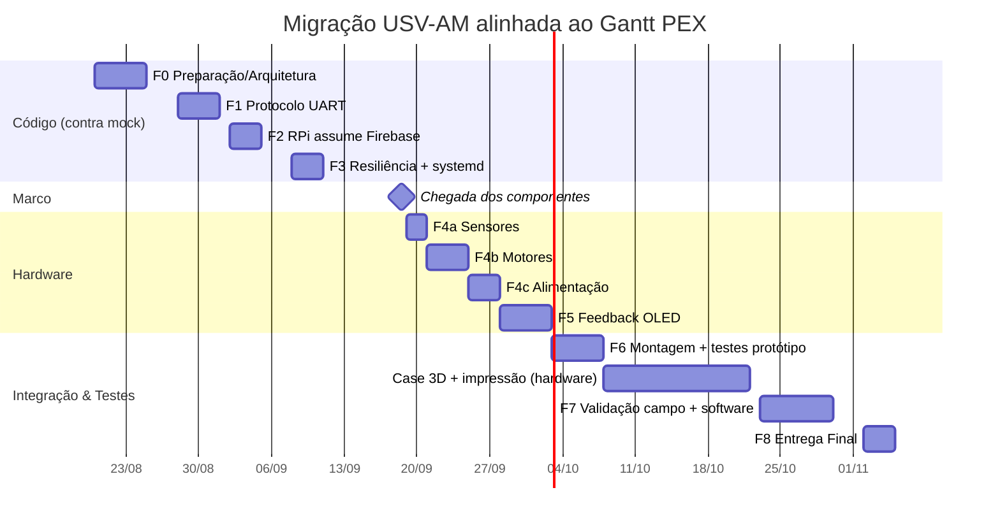

# Plano de Migração USV-AM → Arquitetura Dual (RPi4 + ESP32)

**Alinhado ao Cronograma Gantt PEX — Equipe 2 ARUATECH**
Integrantes: Ariadne Araújo, Leonora Lima, Luciano Santos, Orlando Vandres

> **Invariante inegociável:** em qualquer ponto da migração, desconectar o RPi4 deixa o
> ESP32 navegando sozinho. O RPi4 é aditivo (Firebase, missão, visão, OLED); o controle
> real-time (sensores, PWM de motores, navegação LOS, desvio de obstáculo, buffer offline)
> permanece 100% no ESP32.

---

## Restrição-chave do cronograma

O código deve ser migrado **ANTES** de os componentes chegarem:

- **Migração do código para Raspberry:** 28/08 → 11/09 (13 dias)
- **Chegada dos componentes:** 18-19/09
- **Integração com sensores reais:** a partir de 19/09

**Consequência:** toda a Fase de código (28/08–11/09) é desenvolvida **contra mocks/simulação**
(Raspberry emprestado disponível 24-25/08 para setup do ambiente). A integração com hardware
físico só ocorre na janela de 19/09 em diante.

---

## Mapeamento: Fases de Código ↔ Cronograma Gantt

| Bloco Gantt | Datas | Fase de código (este plano) |
|---|---|---|
| Planejar migração dos módulos ESP32→RPi | 20-24/08 | **F0 — Preparação/Arquitetura** |
| Empréstimo do Raspberry | 24-25/08 | F0 — Setup do ambiente RPi |
| Migração do código para Raspberry | 28/08-11/09 | **F1 (protocolo) + F2 (Firebase) + F3 (resiliência)** — tudo contra mocks |
| Chegada dos componentes | 18-19/09 | Marco de hardware |
| Integração Sensor Presença / GPS / Bússola | 19-21/09 | **F4a — Bring-up de sensores** |
| Integração Motores | 21-25/09 | **F4b — Bring-up de atuadores** |
| Arquitetura de alimentação | 25-28/09 | **F4c — Power** |
| Feedback OLED | 28/09-03/10 | **F5 — Módulo OLED (novo)** |
| Montagem + Testes protótipo | 03-08/10 | **F6 — Integração física** |
| Case 3D + impressão + teste | 08-22/10 | Hardware (fora do escopo de código) |
| Testes semi/controlado + software | 23-30/10 | **F7 — Validação de campo** |
| Entrega Final | 02-05/11 | **F8 — Entrega** |

---

## FASE 0 — Preparação e Arquitetura (20-25/08) ✅ em andamento

**Owner:** Orlando | **Gantt:** "Planejar migração" (0.7) + "Empréstimo do Raspberry"

| # | Tarefa | Entregável |
|---|--------|-----------|
| 0.1 | Definir divisão de responsabilidades ESP32↔RPi | Documento de arquitetura (este) |
| 0.2 | Raspberry emprestado: gravar RPi OS Lite 64-bit + SSH headless | RPi acessível |
| 0.3 | Python 3.11 venv + `pyserial` + `firebase-admin` | Ambiente pronto |
| 0.4 | Service account Firebase (JSON) | Credenciais |
| 0.5 | Branch `feature/rpi4-integration` | Branch no GitHub |

**Critério de saída:** ambiente RPi pronto, arquitetura definida, sem depender dos componentes finais.

---

## FASE 1 — Protocolo de Comunicação UART (28/08-01/09) — CONTRA MOCK

**Owner:** Orlando | **Gantt:** "Migração do código para Raspberry" (parte 1)

| # | Tarefa | Entregável |
|---|--------|-----------|
| 1.1 | Mover GPS do ESP32 para GPIO 25/26 (`config.h`) | Firmware ajustado |
| 1.2 | Módulo firmware `modules/link/serial_link.{h,cpp}` (JSON-lines) | Módulo de I/O serial |
| 1.3 | `rpi/serial_bridge.py` — parser/encoder JSON-lines | Bridge Python |
| 1.4 | **Simulador ESP32** no PC (envia telemetria fake por serial virtual) | Teste sem hardware |
| 1.5 | Teste round-trip contra o simulador | Handshake validado |

**Critério de saída:** RPi troca comandos/telemetria com um ESP32 simulado; `command_id` validado dos dois lados.

---

## FASE 2 — RPi4 assume o Firebase (02-05/09) — CONTRA MOCK

**Owner:** Orlando | **Gantt:** "Migração do código para Raspberry" (parte 2)

| # | Tarefa | Entregável |
|---|--------|-----------|
| 2.1 | `rpi/firebase_client.py` (firebase-admin) | RPi publica no RTDB |
| 2.2 | RPi escuta `/command` e repassa ao ESP32 via UART | Dashboard → RPi → ESP32 |
| 2.3 | RPi publica `status`, `path`, `logs` (dados do ESP32) | RTDB alimentado pelo RPi |
| 2.4 | Flag `RPI_PRESENT` no firmware desliga publicação direta | Sem escrita duplicada |
| 2.5 | Fallback: ESP32 mantém buffer offline se RPi cair (timeout 30s) | Fail-safe |

**Critério de saída:** dashboard controla o drone via RPi (com ESP32 simulado); fallback validado.

---

## FASE 3 — Resiliência e systemd (08-11/09) — CONTRA MOCK

**Owner:** Orlando | **Gantt:** "Migração do código para Raspberry" (parte 3)

| # | Tarefa | Entregável |
|---|--------|-----------|
| 3.1 | `systemd` service para o daemon Python (auto-start + restart) | Serviço resiliente |
| 3.2 | `onDisconnect()` de presença via RPi | Status online/offline |
| 3.3 | Watchdog: reconexão automática do link serial | Auto-recuperação |
| 3.4 | Log rotativo (journald) | SD protegido |
| 3.5 | NetworkManager + ModemManager (WiFi + 4G, se aplicável) | Conectividade redundante |

**Critério de saída:** RPi liga sozinho, se recupera de crash/desconexão. **Fim do bloco de código puro (11/09).**

---

## ⏸ MARCO: Chegada dos componentes (18-19/09)

A partir daqui, integração com hardware real. Tudo antes foi validado contra mocks.

---

## FASE 4 — Bring-up de Hardware (19-28/09)

**Owner:** Orlando | **Gantt:** Integração Sensor Presença/GPS/Bússola/Motores + Alimentação

### F4a — Sensores (19-21/09)
| # | Tarefa | Entregável |
|---|--------|-----------|
| 4a.1 | Integração Sensor de Presença | Sensor lendo |
| 4a.2 | Integração GPS (nos novos pinos GPIO 25/26) | Fix GPS real |
| 4a.3 | Integração Bússola HMC5883L | Heading real |

### F4b — Atuadores (21-25/09)
| # | Tarefa | Entregável |
|---|--------|-----------|
| 4b.1 | Integração Motores + ponte H | PWM real controlando motores |
| 4b.2 | Validar navegação LOS com sensores reais | Missão em bancada |

### F4c — Alimentação (25-28/09)
| # | Tarefa | Entregável |
|---|--------|-----------|
| 4c.1 | Arquitetura de alimentação (bateria → buck 5V/3A RPi + ESP32) | Power estável |
| 4c.2 | Medir consumo dos dois boards | Perfil energético |

**Critério de saída:** sensores + motores reais funcionando com o firmware, alimentação estável.

---

## FASE 5 — Feedback OLED (28/09-03/10) — NOVO (não estava no plano original)

**Owner:** Orlando | **Gantt:** "Integrar Feedback com módulo de tela OLED"

| # | Tarefa | Entregável |
|---|--------|-----------|
| 5.1 | Driver OLED (I2C, ex: SSD1306) no RPi ou ESP32 | Tela inicializada |
| 5.2 | Exibir estado: nav_state, bateria, GPS fix, obstáculo | HUD local |
| 5.3 | Decidir owner do OLED (RPi = mais fácil; ESP32 = funciona offline) | Decisão documentada |

**Critério de saída:** operador vê status crítico na tela local sem depender do dashboard.

> **Decisão pendente:** OLED no RPi (Python, I2C livre) ou no ESP32 (mantém feedback mesmo se
> RPi cair, coerente com a invariante de autonomia). Recomendo **ESP32** para preservar a
> invariante, mas custa pinos I2C já ocupados pela bússola — compartilhável no mesmo barramento.

---

## FASE 6 — Integração Física do Protótipo (03-08/10)

**Owner:** Orlando/Leonora/Luciano | **Gantt:** "Montagem Final" + "Testes do Protótipo"

| # | Tarefa | Entregável |
|---|--------|-----------|
| 6.1 | Montar RPi + ESP32 + sensores + OLED na embarcação | Protótipo montado |
| 6.2 | Teste de missão completa (set_destination → nav → RTH) | Fluxo E2E |
| 6.3 | Teste de queda do RPi durante missão (ESP32 continua) | Fail-safe físico |
| 6.4 | Teste de reconexão + flush de buffer | Sincronização |

**Critério de saída:** missão completa em bancada com todos os componentes, incluindo falha do RPi.

---

## FASE 7 — Validação de Campo + Software (23-30/10)

**Owner:** Orlando/Leonora/Luciano/Ariadne | **Gantt:** Testes semi/controlado + Testes de Software

| # | Tarefa | Entregável |
|---|--------|-----------|
| 7.1 | Testes em ambiente semi-controlado (23-29/10) | Vídeo + logs |
| 7.2 | Testes em ambiente controlado (água, 23-29/10) | Missão multi-waypoint |
| 7.3 | Testes de software E2E (Ariadne/Orlando, 23-30/10) | Suite validada |
| 7.4 | Rodar suíte de testes isolados (`firmware/tests/`) | 7 módulos verdes |

**Critério de saída:** MVP dual validado em água com navegação multi-waypoint e desvio de obstáculo.

---

## FASE 8 — Entrega Final (02-05/11)

**Owner:** Todos | **Gantt:** "Entrega Final"

| # | Tarefa | Entregável |
|---|--------|-----------|
| 8.1 | Atualizar README com arquitetura dual | Docs |
| 8.2 | Merge da branch `feature/rpi4-integration` | PR aprovado |
| 8.3 | Evidências (vídeos, logs, screenshots dashboard) | Trilha de auditoria |

**Critério de saída:** projeto entregue e documentado até 05/11.

---

## Timeline (Gantt Mermaid alinhado ao cronograma oficial)

---

## Conflitos identificados e ajustes propostos

| # | Conflito | Ajuste |
|---|----------|--------|
| 1 | Código migrado (até 11/09) antes do hardware chegar (18/09) | Fases F1-F3 desenvolvidas **contra mocks/simulador**; integração real só na F4 |
| 2 | Janela de código é de 13 dias corridos para 3 fases (protocolo+Firebase+resiliência) | Fases enxutas; resiliência (F3) pode escorregar para a janela pós-hardware se necessário |
| 3 | OLED não estava no plano original | Adicionada F5 (28/09-03/10) conforme Gantt |
| 4 | "Sensor de Presença" no Gantt — não existe no firmware atual | Novo sensor; precisa definir tipo (PIR? ultrassônico extra?) e pinos antes da F4a |
| 5 | Case 3D/impressão (08-22/10) é trabalho de hardware, sem código | Marcado como fora do escopo de software; não bloqueia as fases de código |
| 6 | Gap entre fim do código (11/09) e chegada de componentes (18/09) | Semana de folga — usar para hardening extra dos mocks e testes de software |

### Perguntas em aberto (bloqueiam F4a e F5)
- **Sensor de Presença:** qual modelo? (PIR, radar, ultrassônico dedicado?) Onde entra na arquitetura?
- **OLED:** ownership no ESP32 (preserva autonomia) ou no RPi (mais simples)?
